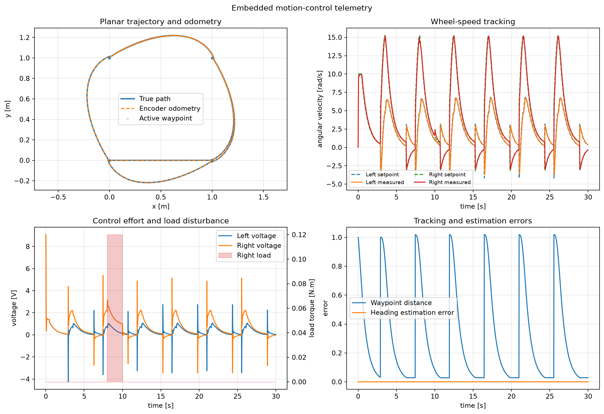
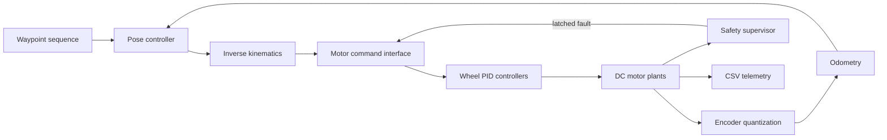

# Motion Control Lab

A portable C++20 laboratory for experimenting with embedded motion-control
software. The project combines actuator dynamics, fixed-rate feedback control,
trajectory generation, differential-drive geometry, encoder odometry, safety
monitoring, deterministic simulation, and automated verification.



## Why this project exists

Motion-control software is easiest to reason about when the controller, plant,
estimator, and safety logic have explicit interfaces and independent tests.
This repository provides a compact environment for exploring those boundaries
without depending on a specific robot, motor drive, or fieldbus vendor.

## Main components

- **Actuator model:** coupled electrical and mechanical DC motor equations,
  integrated with a fourth-order Runge-Kutta solver.
- **Velocity control:** discrete PID with voltage saturation, conditional
  anti-windup, and filtered derivative-on-measurement.
- **Motion generation:** triangular and trapezoidal position profiles with
  velocity and acceleration constraints.
- **Mobile-base geometry:** differential-drive forward/inverse kinematics and
  planar pose integration.
- **State estimation:** quantized wheel encoders and incremental odometry.
- **Path execution:** pose-feedback waypoint follower with bounded linear and
  angular commands.
- **Actuator boundary:** transport-neutral command/feedback interface and a
  two-axis simulated drivetrain.
- **Safety supervision:** latched watchdog, over-current, over-speed, and
  invalid-feedback faults with emergency-stop behavior.
- **Verification:** CTest unit/integration tests, reference and injected-fault
  scenarios, GitHub Actions, CSV telemetry, and Python plots.

## Architecture



The reference simulation runs the low-level loop at **500 Hz**. High-level pose
commands are converted into left/right wheel-speed setpoints, while encoder
ticks close the position-estimation loop. A temporary external load is applied
to one wheel to exercise disturbance rejection.

More detail is available in [docs/architecture.md](docs/architecture.md).

## Reference results

The reference scenario is generated and tested in CI on every push:

- 30-second continuous waypoint-following simulation;
- 1,500 exported telemetry samples;
- maximum planar odometry error: approximately `0.14 mm`;
- mean wheel-speed tracking error after startup: approximately `0.28 rad/s`;
- `0.12 N.m` right-wheel load disturbance between 8 s and 10 s;
- no safety fault in the nominal scenario;
- command-timeout fault detected and latched in the injected-fault scenario.

These numbers describe the deterministic software model and are not presented
as physical robot measurements.

## Build and test

Requirements:

- a C++20 compiler;
- CMake 3.20 or newer;
- Python 3.10+ and Matplotlib for telemetry plots.

```bash
cmake -S . -B build -DCMAKE_BUILD_TYPE=Release
cmake --build build --parallel
ctest --test-dir build --output-on-failure
```

The test suite covers controller saturation and recovery, motor dynamics,
motion-profile boundary conditions, kinematic round trips, encoder odometry,
waypoint commands, safety fault latching, closed-loop wheel-speed tracking, the
complete nominal simulation, and watchdog fault injection.

## Run the simulation

```bash
./build/motion_simulator out/telemetry.csv
```

Inject a command-stream timeout to verify the watchdog and emergency stop:

```bash
./build/motion_simulator out/fault_telemetry.csv --inject-timeout
```

Generate the engineering plots:

```bash
python -m pip install -r requirements.txt
python tools/plot_telemetry.py out/telemetry.csv --output docs/motion_control.png
```

## Repository layout

```text
include/motion/       Public C++ interfaces
src/                  Controller, plant, geometry, estimation, and safety logic
apps/                 Reference simulator
tests/                Unit and end-to-end CTest executable
tools/                Python telemetry visualization
docs/                 Architecture notes and generated reference plot
.github/workflows/    Reproducible Linux build and test pipeline
```

## Engineering boundaries

The `MotorInterface` deliberately separates control logic from transport. The
included implementation is a simulated drivetrain; it does not claim to be a
CAN, CANopen, or EtherCAT driver. A hardware adapter can implement the same
command/feedback contract without changing the motion or safety layers.

The current plant omits gearbox backlash, tyre slip, battery dynamics, PWM
switching, thermal behavior, and asynchronous sensor timing. Those limitations
are documented so that future extensions remain measurable rather than hidden
inside the reference results.

